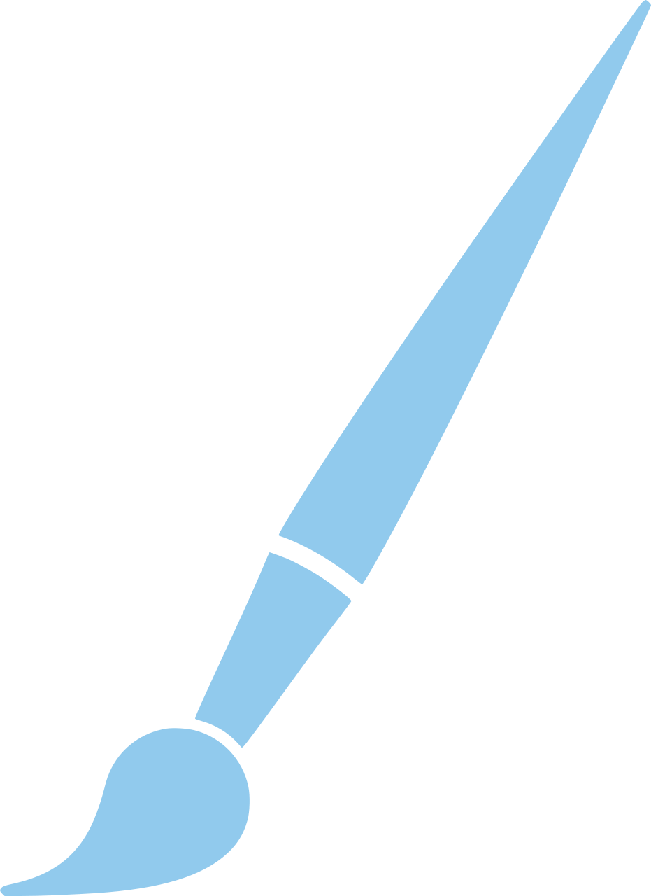
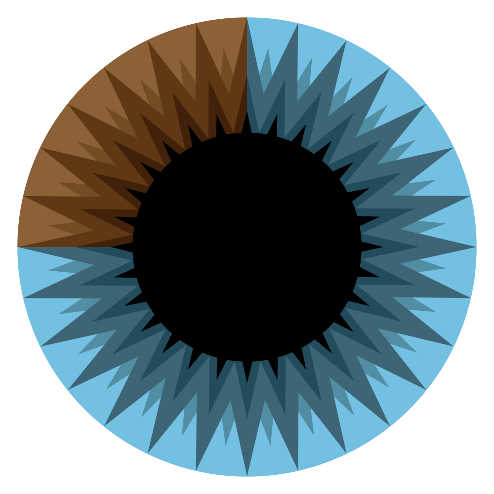
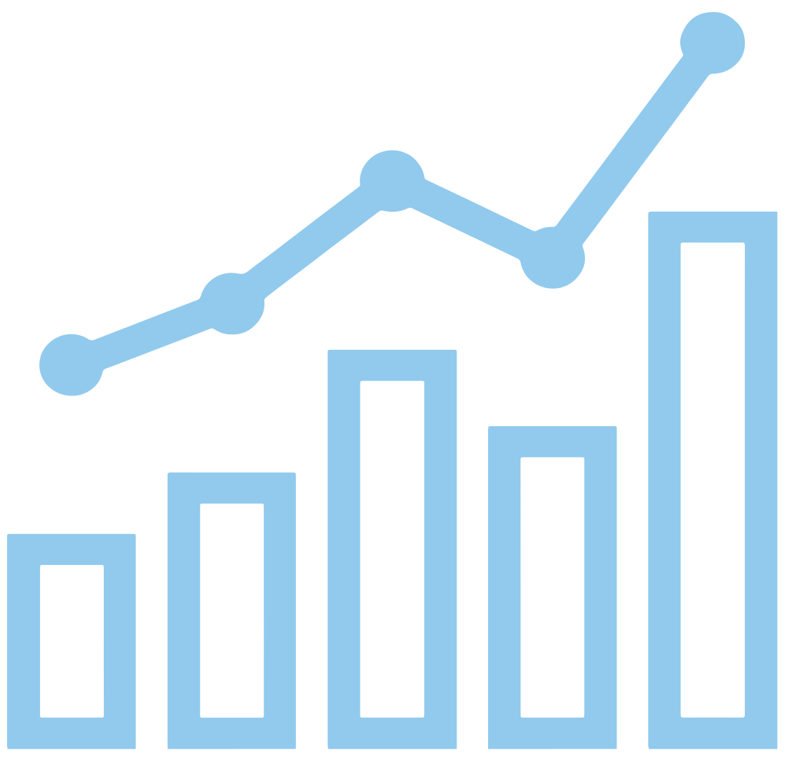

<iframe height='50' scrolling='no' title='Header' src='header.html' frameborder='no' allowtransparency='true' style='width: 100%; user-select:none;'>Header</iframe>

# [Riverli](https://riverway.li)

Hello! 

This website serves as a home for all of my projects. I am a computer scientist and mathematician by trade, but I also love drawing, tennis, and Japanese as hobbies. 

Below is a sample of some of my favorite projects.

<a target="_blank" href="https://riverway.li/qcsg" class="title"><h2 style="top: 5px">Quantum Computing Survival Guide</h2></a>

The quantum computing survival guide is a freely available, interactive online textbook which serves an introduction to quantum computing. I found a lot of available resources for quantum computing are either too simple or too complex. Many articles written for the general public explain qubits and superposition, but fail to explain how those concepts extend to useful computation for solving actual problems. Papers in academic journals assume the reader is already an expert in quantum computation and use advanced ideas without explaining them. I felt there weren't enough resources that bridged that gap for intermediate level readers. The QCSG is still a work in development, but the first several chapters provide a fresh perspective on quantum computing by leveraging interactive applets and 3D graphics.

The textbook was written in Typora and the interactive applets were made with the p5.js library.

<a target="_blank" href="https://www.youtube.com/channel/UCSrJD5Ic4ClxCpg68tVfvOg" class="title"><h2 style="top: 3px">pAInter</h2></a>

I find style transfer networks to be a fascinating field in machine learning. The goal of a style transfer network is to learn an artist's style from a single image and then "paint" over other images in that style. However, painting over video is more tricky because the small changes from one frame to the next can drastically change the output brush strokes. This produces a video with lots of flickering, and we'd like a smooth video. We can use an optical flow library which takes a key frame and morphs it to match the nearby frames of a video. Combined with pre and postprocessing techniques to improve the quality of the output, this model produces beautiful painted videos which can be viewed on my <a target="_blank" href="https://www.youtube.com/channel/UCSrJD5Ic4ClxCpg68tVfvOg">YouTube</a> channel. 

The style transfer network uses the Tensorflow library. Optical flow was done with EbSynth. OpenCV was used for pre and postprocessing.

<a target="_blank" href="https://www.3blue1brown.com/" class="title"><h2 style="top: 6px">3blue1brown Website</h2></a>

3blue1brown is a popular math exposition YouTube channel created by Grant Sanderson which explains math, computer science, and physics topics in an animated fashion. I worked for Grant to translate some of the videos into a written form which were published on his website. We felt that some of the articles would benefit from interactivity so I created the interactive applets for several articles, including Fourier transform, hyperdarts, and quantum mechanics among others.

The website was developed in React. The interactive applets were made with the p5.js library.

<a target="_blank" href="https://riverway.li/minerva" class="title"><h2 style="top: 10px">Integra</h2></a>

Many machine learning engineers have considered training their own artificial intelligence to trade assets in a financial market. Integra is my attempt at time series analysis for trading cryptocurrency. I tried training both an LSTM and CNN for Integra, but they both performed very poorly. I found that training a model on selected indicators instead of price data directly improved the performance considerably. In the future I'd like to experiment to see if sentiment analysis on live social media feed could improve the model even more for long term trends.

BinancePythonAPI was used to connect to the crypto exchange. Tensorflow was used for training and evaluating the models.

<a target="_blank" href="https://riverway.li/kikai" class="title"><h2 style="top: 6px">Project Kikai</h2></a>

My master's thesis project is in Natural Language Generation for producing an artificial YouTuber. I am trying to use GPT2 to generate scripts of YouTube videos and then have a voice synthesizer create an audio version of the script. The next step is to perform emotion analysis (an extension of sentiment analysis) to animate a figure for the video component. So far, a number of problems have already shown up when using just one GPT2 model. So the idea is to now train two GPT2 models on different sources and have them converse with each other. This helps bring new topics into the conversation and avoids the script just going in circles.

OpenGPT is used for training and evaluating the text generation models.

<a target="_blank" href="https://riverway.li/qilcom/Qilcom_Model.pdf" class="title"><h2 style="top: 6px">QILCOM Research Project</h2></a>

QILCOM is the Quantum Ideas Lab Competition hosted by Stevens Institute of Technology. It is a research competition where teams of undergraduates are paired up with a PhD student to perform experiments and conduct research in the field of quantum computing. My team attempted to find a state estimation algorithm which could approximate the resulting state of certain types of quantum circuits more efficiently. Simulating general quantum circuits is extremely expensive in time and space complexity, so our algorithm could dramatically reduce that time for specific types of quantum circuits by sacrificing a bit of accuracy. Although it fails to efficiently simulate circuits like Grover's search or Shor's factoring algorithm, it can offer improvement against Google's Random Circuit Sampling problem.

This project was developed in Java without any additional libraries.

